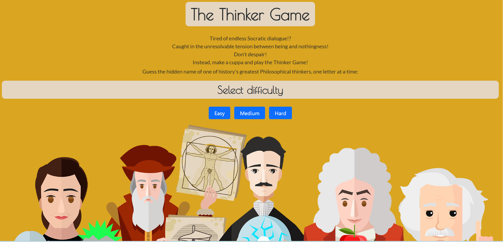
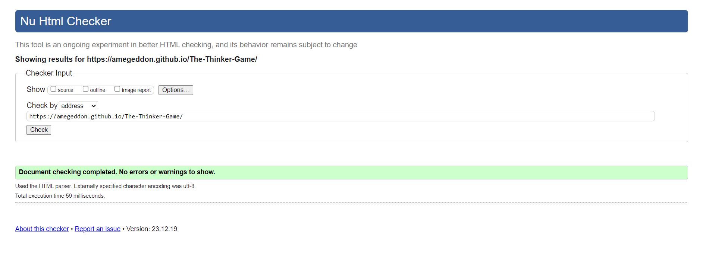
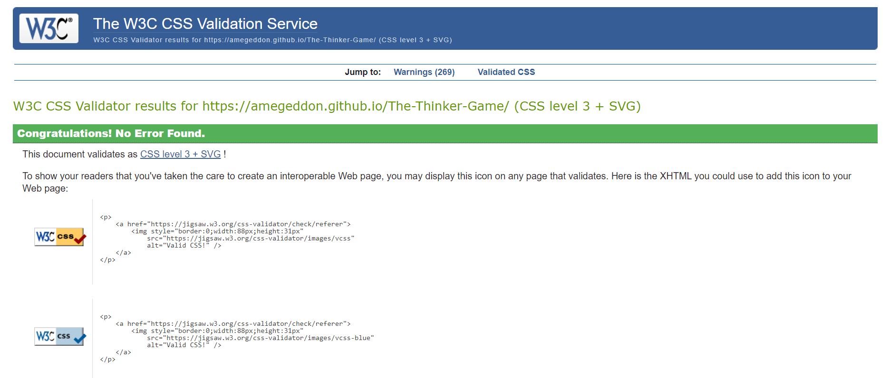
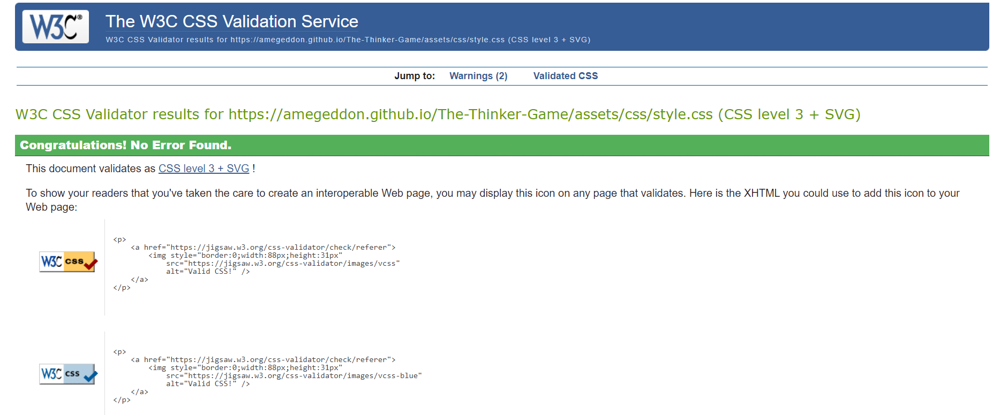
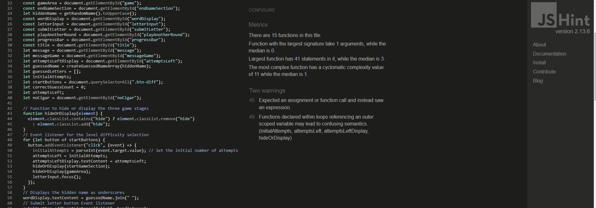

# The Thinker Game

**Developer: Amy Cook**

[Visit live website](http)

## Table of Content

- [Project Goals](#project-goals)
  - [User Goals](#user-goals)
  - [Site Owner Goals](#site-owner-goals)
- [User Experience](#user-experience)
  - [Target Audience](#target-audience)
  - [User Requirements and Expectations](#user-requirements-and-expectations)
- [User Stories](#user-stories)
  - [Site User](#site-user)
  - [Site Owner](#site-owner)
- [Design](#design)
  - [Colour Scheme](#colour-scheme)
  - [Fonts](#fonts)
  - [Structure](#structure)
  - [Wireframes](#wireframes)
- [Technologies Used](#technologies-used)
  - [Languages](#languages)
  - [Frameworks, Libraries & Tools](#frameworks-libraries--tools)
- [Features](#features)
- [Validation](#validation)
  - [HTML Validation](#html-validation)
  - [CSS Validation](#css-validation)
  - [JavaScript Validation](#javascript-validation)
  - [Accessibility](#accessibility)
  - [Performance](#performance)
- [Testing](#testing)
  - [Performing tests on various devices](#performing-tests-on-various-devices)
  - [Browser compatibility](#browser-compatibility)
  - [Testing user stories](#testing-user-stories)
- [Bugs](#bugs)
- [Deployment](#deployment)
- [Credits](#credits)
- [Acknowledgements](#acknowledgements)

## Project Goals

- Develop an intuitive and user-friendly philosophy themed word guessing game for an engaging user experience. 

### User Goals
- Enjoy a game with straightforward rules that is easy to use and engaging.
- Challenge the users knowledge of Philosophical thinkers

### Site Owner Goals

- Develop an entertaining and engaging game.
- Implement simple navigation throughout the website.
- Craft a visually appealing design for enhanced user experience.
- Ensure a fully responsive and accessible website for a seamless user interaction.

## User Experience

### Target Audience

- The game is for anyone who enjoys guessing games 
- And for those with an interest in philosophy and philosophers in particular

### User Requirements and Expectations

- Clear game instructions
- Straightforward navigation 
- Responsive design for all device types 
- Reliable game functions that work as expected
- Visually appealing design 
- Accessibility 

## User Stories

### Site User

1. Comprehensible Game Instuctions: instructions that are easy to grasp, ensuring a straightforward understanding of how to play the game.
2. Adaptable Difficulty Levels: A feature allowing me to choose from various difficulty levels, tailoring the game's challenge to my preference.
3. Dual Interaction Methods: The flexibility to engage with the game using both mouse clicks and keyboard inputs, providing a choice that suits my preferred playing style.
4. Progress Tracking: A visual representation of my progress alongside the remaining number of attempts in each round, ensuring a clear understanding of my progress.
5. Result Display: After successfully guessing a word, I would like to see a message of congratulations alongside a philosophical quote, adding a sense of achievement to the gameplay.
6. After incorrectly guessing the word, I would like to immediately know what the correct answer was. 
7. A scoreboard to track the frequency of correct answers, providing a clear record of successful guesses. 

### Site Owner

8. Clear Game Understanding and navigation: Ensuring users easily comprehend the game mechanics for a seamless and enjoyable experience.
9. Self-Challenge Capability: Providing users with the opportunity to change the difficulty setting and enhance their skills while playing.
10. Full Responsiveness: Designing the game to adapt effortlessly to various screen sizes and devices, ensuring accessibility for all users.
11. To create a visually captivating game with a well-thought-out and aesthetically pleasing design.
12. The user to be directed to a custom 404 error page upon entering a non-existent URL, eliminating the need to rely on the browser's back button.

## Design

### Colour Scheme

- Consistency was maintained in the color scheme across all screens, with the primary background color being #daa520. This choice was made as the vibrant orange was a good compliment to the images used, creating a cohesive and aesthetically pleasing visual experience.
- The background color for the heading, #e5d6c2, was deliberately selected for its ability to complement the vibrant orange whilst also maintaining a good contrast with the black text color for readability.

### Fonts

- Google Fonts were  integrated into the website, with Lato as the primary font, accompanied by a sans-serif fallback for optimal readability across all screens. To inject a stylish but playful touch, Poiret One with its art deco easthetic was selected for the game title and headings, this font pairs nicely with Lato. 

### Structure

- The website structure has been designed for user-friendliness, emphasizing easy learning and navigation. Key components of the game include:
 
  1.  Home Page / Start Screen: 
      - Features game title and instructions for guidance.
      - Game difficulty button select, allowing users to select their preferred difficulty level.

  2.  Main Game Screen:

      - Reveals a hidden name with underscores for each letter.
      - Highlights the number of remaining guesses in the round.
      - Clear representation of advancement throughout the gaming experience through the use of a progress bar
      - Scoreboard showing current score. 
      - A "Back" button is included for users to easily return to the home page/start sceren at their convenience.

  3. Correct guess screen: 
      - Reveals congratulations message alongside a philosophical quote. 
      - Features background image of euripides in the bath shouting eureka. 
      - Displays scoreboard showing total number of correct guesses.
      - This screen also features convenient options with a "Play Another Round" button and a "Quit" button for seamless navigation and user control.

   4. Incorrect guess screen:   
      - Reveals incorrect message alongside correct answer to enahance user's learning experience.
      - Features background image of Freud 
      - Displays scoreboard showing total number of correct guesses.
      - Like the correct guess screen there are the options to "Play another round" or "quit" and return to the start screen. 

### Wireframes

Big screens - laptop & desktop

Medium screens - tablets

Small screens - mobile

## Technologies Used

### Languages

- HTML
- CSS
- JavaScript

### Frameworks, Libraries & Tools

- [Bootstrap v5.1.3](https://getbootstrap.com/)
- [Git](https://git-scm.com/)
- [GitHub](https://github.com/) was used as a remote repository to store project code and host the webpage 
- [Chrome dev tools](https://developers.google.com/web/tools/chrome-devtools)
- [Am I Responsive](http://ami.responsivedesign.is/)
- [Adobe Stock Images]
- [Font Awesome](https://fontawesome.com/)
- [Google Fonts](https://fonts.google.com/)
- [WC3 Validator](https://validator.w3.org/), [Jigsaw W3 Validator](https://jigsaw.w3.org/css-validator/), [JShint](https://jshint.com/), [Wave Validator](https://wave.webaim.org/), [Lighthouse](https://developers.google.com/web/tools/lighthouse/) and [Am I Responsive](http://ami.responsivedesign.is/) were all used to validate the website

## Features

The website has just the one webpage and utilises a hide or Display function to toggle between the three game sections: Home page/Start Screen, Main Game Screen and End Screen. The game incorporates the following features:

### Home screen/Start Screen

- Game title 
- Game instructions
- Three difficulty level buttons (easy, medium, and hard) enabling users to choose their preferred level of challenge.

- User stories covered: 1, 2, 8, 9 

See feature

### Game screen

- Underscores for each letter of the hidden phrase
- Input area for letters that can be submitted through either mouse click or the enter button, enhancing the game's pace for a faster and more fluid playing experience. 
- Remaining guess attempts in the current round.
- Visual progress bar indicating the proximity of the user to correctly guessing the concealed thinker.
- Current user score 

- User stories covered: 3, 4, 7

See feature

### Correct Guess Screen

- A congratulatory message is relayed to the user, affirming that their guess was accurate, and they have successfully identified the hidden thinker.
- Includes an image of Archimedes in the bath, exclaiming "Eureka, to infuse the game with a fun and captivating ambiance.
- Rewards players with "Wisdom Winnings" in the form of a profound philosophical quote to instill a sense of achievement and the feeling of winning a prize.
- Incorporation of a "Play Another Round" button for seamless navigation and continuous gameplay.
- Displays the user's current score prominently for immediate reference.
- Integration of a "Quit" button for users to exit the game at their discretion.

- User stories covered: 5, 11, 8, 7

See feature

### Wrong Guess Screen

- A commiserations message is conveyed to the user, sharing the correct answer they missed in the guessing game.
- an image of Freud smoking a cigar as a background accompaniment to the message, enriching the game's aesthetics for a more immersive experience.
- Incorporation of a "Play Another Round" button for seamless navigation and continuous gameplay.
- Displays the user's current score prominently for immediate reference.
- Integration of a "Quit" button for users to exit the game at their discretion.

- User stories covered: 6, 11, 9, 7

See feature

### 404 error page

- A 404 error page is presented when users enter a non-existent URL.
- Users are redirected to the main page with the option to continue playing via the "Let's Play the Game" button.

- User stories covered: 12

See feature

## Validation

### HTML Validation

The website's HTML was validated using the W3C Markup Validation Service, with all pages passing without errors.

index.html

404 error page

### CSS Validation

The W3C Jigsaw CSS Validation Service was used to validate the CSS of the website. Upon validation
When validating all website,

All site

Style.css

### JavaScript Validation

JavaScript files were validated using the JSHint JS Validation Service, revealing no significant issues.

game.js

### Accessibility

The WAVE WebAIM accessibility evaluation tool was utilized to ensure compliance with accessibility standards. No errors were identified, affirming the website's accessibility.

Home page

404 page

### Performance

Google Lighthouse in Google Chrome Developer Tools was used to test the performance of the website.

Home page

404 page

## Testing

### Performing tests on various devices

The website was tested using Google Chrome Developer Tools Toggle Device Toolbar to simulate viewports of different devices.

The website was tested on the following devices:

- Windows Surface pro (laptop screen size)
- Ipad (tablet screen)
- Huawei P30 (mobile screen)
- Apple 10 (mobile screen)
- Samsung galaxy 21 (mobile screen)

### Browser compatibility

- Testing has been carried out on the following browsers:
  - Googe Chrome Version .... which version
  - Firefox Browser .. check version

### Testing user stories

1. I want to easily understand the rules of the game

| **Feature**       | **Action**        | **Expected Result**                  | **Actual Result** |
| ----------------- | ----------------- | ------------------------------------ | ----------------- |
| Instructions Icon | Click on the icon | Modal with game instructions pops up | Works as expected |

Screenshot

2. I want to enter my name and have it visible on screen while the game is played

| **Feature**    | **Action**                                                           | **Expected Result**                               | **Actual Result** |
| -------------- | -------------------------------------------------------------------- | ------------------------------------------------- | ----------------- |
| Username input | Type user name (1-12 characters) and click button or press Enter key | User log in and name displayed in top left corner | Works as expected |

Screenshot

3. I want to be able to choose a difficulty level for the game

| **Feature**             | **Action**                                                             | **Expected Result**                                                                                     | **Actual Result** |
| ----------------------- | ---------------------------------------------------------------------- | ------------------------------------------------------------------------------------------------------- | ----------------- |
| Difficulty level screen | Click one of the three buttons on the screen to play the relevant game | The chosen game level screen loads. Game level and number of guesses are displayed on top right corner. | Works as expected |

Screenshot

4. I want to have different categories of phrases to guess from

| **Feature**                           | **Action**                               | **Expected Result**                                                       | **Actual Result** |
| ------------------------------------- | ---------------------------------------- | ------------------------------------------------------------------------- | ----------------- |
| Difficulty level screen & Game screen | Select the level of desired game to play | The phrase category is displayed on the game screen above the sun picture | Works as expected |

Screenshot

5. I want to be able to play the game both by clicking the mouse and by using the keyboard

| **Feature** | **Action**                                                               | **Expected Result**                                                                        | **Actual Result** |
| ----------- | ------------------------------------------------------------------------ | ------------------------------------------------------------------------------------------ | ----------------- |
| Game screen | Click on the displayed alphabet buttons or press the key on the keyboard | The letter which have already been clicked/pressed changes color and cannot be used again. | Works as expected |

Screenshot

6. I want to be able to see which letters I have already guessed and the number of guesses I have left in the round

| **Feature** | **Action**                                                               | **Expected Result**                                                                                              | **Actual Result** |
| ----------- | ------------------------------------------------------------------------ | ---------------------------------------------------------------------------------------------------------------- | ----------------- |
| Game screen | Click on the displayed alphabet buttons or press the key on the keyboard | Used letters change color and cannot be used again. Number of remaining guesses is displayed in top right corner | Works as expected |

Screenshot

7. I want to see my result after I guessed the phrase

| **Feature**          | **Action**                                                                            | **Expected Result**                                             | **Actual Result** |
| -------------------- | ------------------------------------------------------------------------------------- | --------------------------------------------------------------- | ----------------- |
| Correct Guess Screen | Guess the hidden phrase within specific number of guesses for the game level selected | The message and number of points scored in the round displayed. | Works as expected |

Screenshot

8. I want to see the phrase I didn’t manage to guess

| **Feature**        | **Action**                                                  | **Expected Result**             | **Actual Result** |
| ------------------ | ----------------------------------------------------------- | ------------------------------- | ----------------- |
| Wrong Guess Screen | All guesses were used and the hidden phrase was not guessed | The correct phrase is displayed | Works as expected |

Screenshot

9. I want to be able to play the game on desktop, tablet and mobile devices

| **Feature**                                   | **Action**                | **Expected Result**                      | **Actual Result** |
| --------------------------------------------- | ------------------------- | ---------------------------------------- | ----------------- |
| Every page has been designed to be responsive | Change device screen size | The site works on different screen sizes | Works as expected |

Screenshot

10. I want to be able to get in touch with the developer

| **Feature**  | **Action**                               | **Expected Result**       | **Actual Result** |
| ------------ | ---------------------------------------- | ------------------------- | ----------------- |
| Contact Form | Click on the envelope icon in the footer | Displays the contact form | Works as expected |

Screenshot

11. I want to be sure that my message has been sent

| **Feature**                      | **Action**                                           | **Expected Result**                        | **Actual Result** |
| -------------------------------- | ---------------------------------------------------- | ------------------------------------------ | ----------------- |
| Contact Form confirmation screen | Fill in the contact form and click the submit button | The contact form confirmation is displayed | Works as expected |

Screenshot

12. I want user to easily understand the game

| **Feature**       | **Action**                      | **Expected Result**                  | **Actual Result** |
| ----------------- | ------------------------------- | ------------------------------------ | ----------------- |
| Instructions Icon | Click on the icon on any screen | Modal with game instructions pops up | Works as expected |

Screenshot

13. I want the user to be able to challenge themselves

| **Feature**             | **Action**                                                                                                                  | **Expected Result**                             | **Actual Result** |
| ----------------------- | --------------------------------------------------------------------------------------------------------------------------- | ----------------------------------------------- | ----------------- |
| Difficulty level screen | User selects on of the three available levels of the game which includes the hard version with only a few available guesses | The game level screen loads of the chosen game. | Works as expected |

Screenshot

14. I want my game to be fully responsive

| **Feature**                                   | **Action**                | **Expected Result**                      | **Actual Result** |
| --------------------------------------------- | ------------------------- | ---------------------------------------- | ----------------- |
| Every page has been designed to be responsive | Change device screen size | The site works on different screen sizes | Works as expected |

Screenshot

15. I want the user to come to a 404 error page instead of having to use the browser back button if they enter a url that does not exist

| **Feature**    | **Action**           | **Expected Result**                                                                       | **Actual Result** |
| -------------- | -------------------- | ----------------------------------------------------------------------------------------- | ----------------- |
| 404 error page | Page cannot be found | When a user types the wrong address or cannot find a page they are rerouted to a 404 page | Works as expected |

Screenshot

16. I want user to be able to contact me and provide their feedback

| **Feature**  | **Action**                                                  | **Expected Result**                                              | **Actual Result** |
| ------------ | ----------------------------------------------------------- | ---------------------------------------------------------------- | ----------------- |
| Contact Form | User fills in the contact form and clicks the submit button | Developer receives email with user's contact details and message | Works as expected |

Screenshot

## Bugs

| Bug                                                                                                                                         | Fix                                                                                    |
| ------------------------------------------------------------------------------------------------------------------------------------------- | -------------------------------------------------------------------------------------- |
| All div with difficulty level buttons was responsive to click event and game level which appeared on the game screen was 'null'             | Added code for click event to only respond on elements with specific class (buttons)   |
| W3C Markup Validation Service highlighted that heading was not closed                                                                       | Corrected the error by closing the h1 tag                                              |
| Number of remaining guesses displayed on the cloud icon went below 0                                                                        | Amended code to display 0 when there were no guesses left                              |
| Images for medium & hard level game were not showing on the game screen                                                                     | There was an error in image path in game-data.js file which I corrected                |
| Game container was going off the screen for iPhone 5/ SE when tested with Chrome DevTools                                                   | Changed offset of game container for screens max-width: 390px                          |
| When added footer to the game screen it was located at the top of the screen                                                                | Set footer with position fixed                                                         |
| Whilst the contact form was validated, no data was sent to email                                                                            | Set up an email template and amended code with specific contact_service & contact_form |
| Game container was going off the background leaving a white space below the background image on mobile and tablet screen in horizontal view | Changed background image position from absolute to fixed                               |
| Contact form username input was pushed off the screen when user clicked on the element, making the input invisible to the user              | Add contact form container offset on username input focus                              |

## Deployment

### GitHub Pages

The website was deployed using GitHub Pages by following these steps:

1. In the GitHub repository navigate to the Settings tab
2. On the left hand menu select Pages
3. For the source select Branch: main
4. Once saved, GitHub will refresh and your website will be publishd from GitHub repository
5. The link to your published website will appear: "Your site is published at https://aleksandracodes.github.io/CI_PP2_SunshineGuessing/"

### Forking the GitHub Repository

1. Go to the GitHub repository
2. Click on Fork button in top right corner

### Making a Local Clone

1. Go to the GitHub repository
2. Locate the Code button above the list of files and click it
3. Highlight the "HTTPS" button to clone with HTTPS and copy the link
4. Open Git Bash
5. Change the current working directory to the one where you want the cloned directory
6. Type git clone and paste the URL from the clipboard ($ git clone https://github.com/YOUR-USERNAME/YOUR-REPOSITORY)
7. Press Enter to create your local clone

## Credits

### Images

- arrow used on back button was taken from [Fontawesome](https://fontawesome.com/)
- The four images used all come from Adobe Stock images and have been licensed for use [Adobe Stock Images](https://stock.adobe.com/uk)
- Images edited to remove background and resized using adobe Photoshop 

### Code

- 

## Acknowledgements

Thanks in plentiful supply for everyone who has put up with me cursing javascript. 

- to my mentor Richard for reminding me at every mentor meeting that Javascript is brilliant
- and to everyone else that I have hounded into playing the game and giving me feedback
- finally, thanks to the slack community for their encouragement and advice. 
- and not forgetting the tutor team who have been able to point me in the right direction when a game bug looked impossibly unsolvable.
