# The Thinker Game

**Developer: Amy Cook**

[Visit live website](https://amegeddon.github.io/The-Thinker-Game)

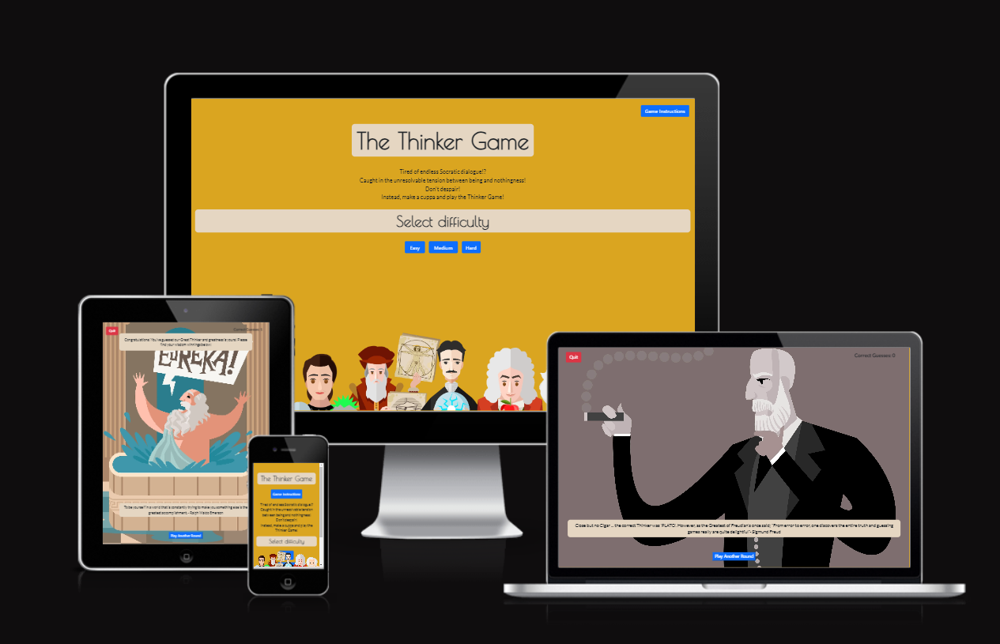

## Table of Content

- [Project Goals](#project-goals)
  - [User Goals](#user-goals)
  - [Site Owner Goals](#site-owner-goals)
- [User Experience](#user-experience)
  - [Target Audience](#target-audience)
  - [User Requirements and Expectations](#user-requirements-and-expectations)
- [User Stories](#user-stories)
  - [Site User](#site-user)
  - [Site Owner](#site-owner)
- [Design](#design)
  - [Colour Scheme](#colour-scheme)
  - [Fonts](#fonts)
  - [Structure](#structure)
  - [Wireframes](#wireframes)
- [Technologies Used](#technologies-used)
  - [Languages](#languages)
  - [Frameworks, Libraries & Tools](#frameworks-libraries--tools)
- [Features](#features)
- [Validation](#validation)
  - [HTML Validation](#html-validation)
  - [CSS Validation](#css-validation)
  - [JavaScript Validation](#javascript-validation)
  - [Accessibility](#accessibility)
  - [Performance](#performance)
- [Testing](#testing)
  - [Performing tests on various devices](#performing-tests-on-various-devices)
  - [Browser compatibility](#browser-compatibility)
  - [Testing user stories](#testing-user-stories)
- [Bugs](#bugs)
- [Deployment](#deployment)
- [Credits](#credits)
- [Acknowledgements](#acknowledgements)

## Project Goals

- Develop an intuitive and user-friendly philosophy themed word guessing game for an engaging user experience. 

### User Goals
- Enjoy a game with straightforward rules that is easy to use and engaging.
- Challenge the users knowledge of Philosophical thinkers

### Site Owner Goals

- Develop an entertaining and engaging game.
- Implement simple navigation throughout the website.
- Craft a visually appealing design for enhanced user experience.
- Ensure a fully responsive and accessible website.

## User Experience

### Target Audience

- The game is for anyone who enjoys guessing games 
- And for those with an interest in philosophy and philosophers in particular

### User Requirements and Expectations

- Clear game instructions
- Straightforward navigation 
- Responsive design for all device types 
- Reliable game functions that work as expected
- Visually appealing design 
- Accessibility 

## User Stories

### Site User

1. Comprehensible Game Instuctions: instructions that are easy to grasp, ensuring a straightforward understanding of how to play the game.
2. Adaptable Difficulty Levels: A feature allowing me to choose from various difficulty levels, tailoring the game's challenge to my preference.
3. A hint function that displays on the final attempt at guessing the hidden thinker. 
4. Progress Tracking: A visual representation of my progress alongside the remaining number of attempts in each round, ensuring a clear understanding of my progress.
5. Result Display: After successfully guessing a word, I would like to see a message of congratulations alongside a philosophical quote, adding a sense of achievement to the gameplay.
6. After incorrectly guessing the word, I would like to immediately know what the correct answer was. 
7. A scoreboard to track the frequency of correct answers, providing a clear record of successful guesses. 

### Site Owner

8. Clear Game Understanding and navigation: Ensuring users easily comprehend the game mechanics for a seamless and enjoyable experience.
9. Self-Challenge Capability: Providing users with the opportunity to change the difficulty setting and enhance their skills while playing.
10. Full Responsiveness: Designing the game to adapt effortlessly to various screen sizes and devices, ensuring accessibility for all users.
11. The user to be directed to a custom 404 error page upon entering a non-existent URL, eliminating the need to rely on the browser's back button.

## Design

### Colour Scheme

- Consistency was maintained in the color scheme across all screens, with the primary background color being #daa520. This choice was made as the vibrant orange was a good compliment to the images used, creating a cohesive and aesthetically pleasing visual experience.
- The background color for the heading, #e5d6c2, was deliberately selected for its ability to complement the vibrant orange whilst also maintaining a good contrast with the black text color for readability.

### Fonts

- Google Fonts were  integrated into the website, with Lato as the primary font, accompanied by a sans-serif fallback for optimal readability across all screens. To inject a stylish but playful touch, Poiret One with its art deco easthetic was selected for the game title and headings, this font pairs nicely with Lato. 

### Structure

- The website structure has been designed for user-friendliness, emphasizing easy learning and navigation. Key components of the game include:
 
  1.  Home Page / Start Screen: 
      - Features game title and instructions for guidance.
      - Game difficulty button select, allowing users to select their preferred difficulty level.

  2.  Main Game Screen:

      - Reveals a hidden name with underscores for each letter.
      - Highlights the number of remaining guesses in the round.
      - Clear representation of advancement throughout the gaming experience through the use of a progress bar
      - Scoreboard showing current score. 
      - A "Back" button is included for users to easily return to the home page/start sceren at their convenience.

  3. Correct guess screen: 
      - Reveals congratulations message alongside a philosophical quote. 
      - Features background image of euripides in the bath shouting eureka. 
      - Displays scoreboard showing total number of correct guesses.
      - This screen also features convenient options with a "Play Another Round" button and a "Quit" button for seamless navigation and user control.

   4. Incorrect guess screen:   
      - Reveals incorrect message alongside correct answer to enahance user's learning experience.
      - Features background image of Freud 
      - Displays scoreboard showing total number of correct guesses.
      - Like the correct guess screen there are the options to "Play another round" or "quit" and return to the start screen. 

### Wireframes

Laptop & desktop

Mobile

## Technologies Used

### Languages

- HTML
- CSS
- JavaScript

### Frameworks, Libraries & Tools

- [Bootstrap v5.1.3](https://getbootstrap.com/)
- [Git](https://git-scm.com/)
- [GitHub](https://github.com/) was used as a remote repository to store project code and host the webpage 
- [Chrome dev tools](https://developers.google.com/web/tools/chrome-devtools)
- [Am I Responsive](http://ami.responsivedesign.is/)
- [Adobe Stock Images]
- [Font Awesome](https://fontawesome.com/)
- [Google Fonts](https://fonts.google.com/)
- [WC3 Validator](https://validator.w3.org/), [Jigsaw W3 Validator](https://jigsaw.w3.org/css-validator/), [JShint](https://jshint.com/), [Wave Validator](https://wave.webaim.org/), [Lighthouse](https://developers.google.com/web/tools/lighthouse/) and [Am I Responsive](http://ami.responsivedesign.is/) were all used to validate the website

## Features

The website has just the one webpage and utilises a hide or Display function to toggle between the three game sections: Home page/Start Screen, Main Game Screen and End Screen. The game incorporates the following features:

### Home screen/Start Screen

- Game title 
- Game instructions
- Three difficulty level buttons (easy, medium, and hard) enabling users to choose their preferred level of challenge.

- User stories covered: 1, 2, 8, 9 

See feature

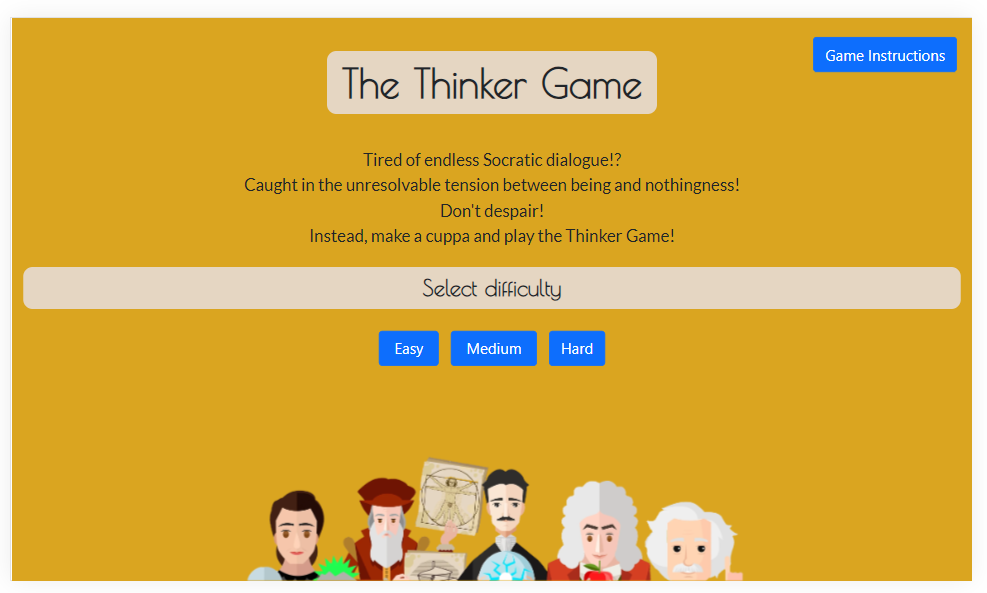

### Game screen

- Underscores for each letter of the hidden phrase
- Input area for letters that can be submitted through either mouse click or the enter button, enhancing the game's pace for a faster and more fluid playing experience. 
- Remaining guess attempts in the current round.
- Visual progress bar indicating the proximity of the user to correctly guessing the concealed thinker.
- Current user score 

- User stories covered: 3, 4, 7

See feature

### Correct Guess Screen

- A congratulatory message is relayed to the user, affirming that their guess was accurate, and they have successfully identified the hidden thinker.
- Includes an image of Archimedes in the bath, exclaiming "Eureka, to infuse the game with a fun and captivating ambiance.
- Rewards players with "Wisdom Winnings" in the form of a profound philosophical quote to instill a sense of achievement and the feeling of winning a prize.
- Incorporation of a "Play Another Round" button for seamless navigation and continuous gameplay.
- Displays the user's current score prominently for immediate reference.
- Integration of a "Quit" button for users to exit the game at their discretion.

- User stories covered: 5, 11, 8, 7

See feature

### Wrong Guess Screen

- A commiserations message is conveyed to the user, sharing the correct answer they missed in the guessing game.
- an image of Freud smoking a cigar as a background accompaniment to the message, enriching the game's aesthetics for a more immersive experience.
- Incorporation of a "Play Another Round" button for seamless navigation and continuous gameplay.
- Displays the user's current score prominently for immediate reference.
- Integration of a "Quit" button for users to exit the game at their discretion.

- User stories covered: 6, 11, 9, 7

See feature

### 404 error page

- A 404 error page is presented when users enter a non-existent URL.
- Users are redirected to the main page with the option to continue playing via the "Let's Play the Game" button.

- User stories covered: 12

See feature

## Validation

### HTML Validation

The website's HTML was validated using the W3C Markup Validation Service, with all pages passing without errors.

index.html

404 error page

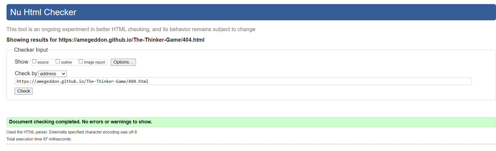

### CSS Validation

The W3C Jigsaw CSS Validation Service was used to validate the CSS of the website. Upon validation
When validating all website,

All site

Style.css

### JavaScript Validation

JavaScript files were validated using the JSHint JS Validation Service, revealing no significant issues.

game.js
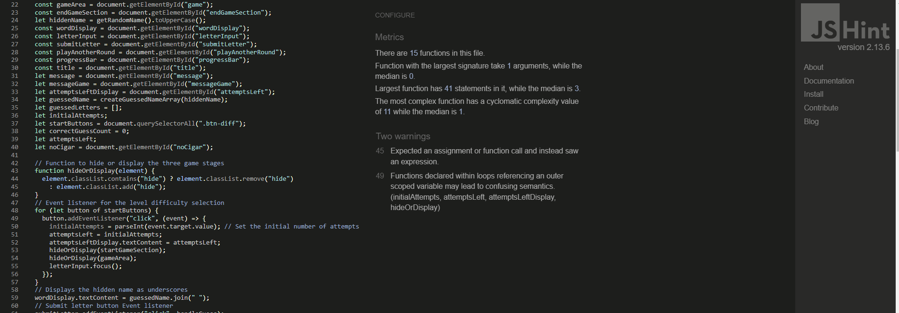

### Accessibility

The WAVE WebAIM accessibility evaluation tool was utilized to ensure compliance with accessibility standards. No errors were identified, affirming the website's accessibility. An alert was identified, suggesting that the hidden word might be mistakenly perceived as a header. To enhance accessibility, an ARIA role of "text" and an ARIA level of "0" were implemented, ensuring that the hidden word is explicitly recognized as non-header content. However, the evaulation tool contiunes to flag the alert.

index.html
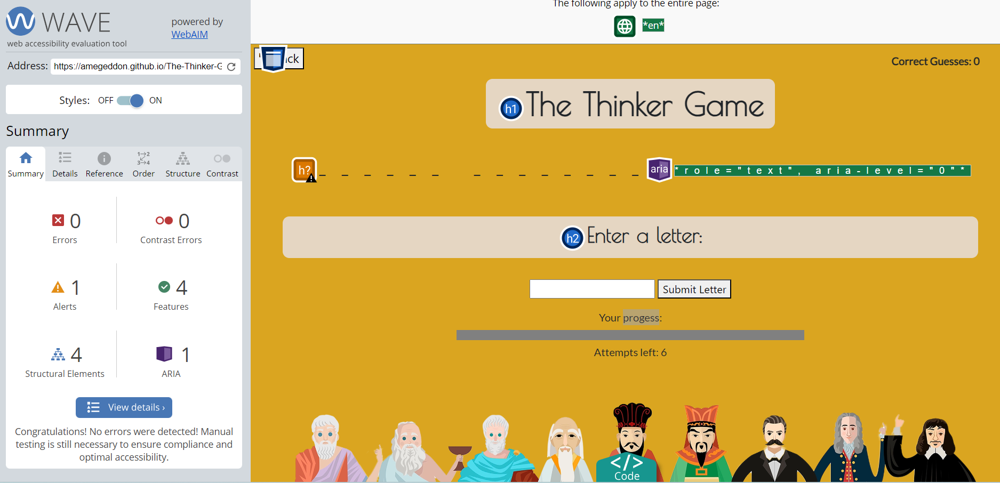

404 error page

### Performance

Google Lighthouse within Google Chrome Developer Tools served as the performance testing tool for the website, providing insights into various aspects such as performance, accessibility, SEO, and best practices. The performance scores for desktop mode were consistently excellent across all testing parameters. However, during mobile testing, the performance score registered at 63. In an effort to enhance this score, all image files underwent resizing, compression, and conversion to webp format. Additionally, to further boost performance, the CSS was minified. The combined effect of these two measures resulted in an improved performance score of 84.

Home page desktop 
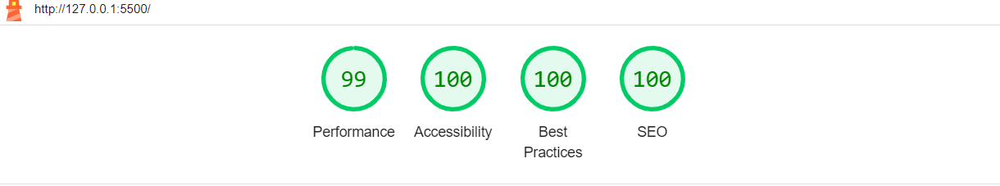

Home page mobile 
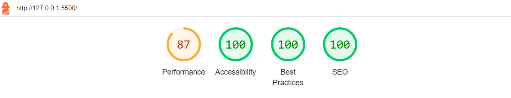

404 page

## Testing

### Performing tests on various devices

The website underwent testing with Google Chrome Developer Tools, utilizing the Toggle Device Toolbar to simulate various device viewport sizes.

The website was tested on the following devices:

- lenovo Ideapad L340 (laptop screen)
- Windows Surface pro 5 (small laptop screen size)
- Ipad (tablet screen)
- Huawei P30 (mobile screen)
- Apple 10 (mobile screen)
- Samsung galaxy 21 (mobile screen)

### Browser compatibility

- Testing has been carried out on the following browsers:
  - Googe Chrome Version 120.0.6099.199
  - Firefox Browser 121.0

### Testing user stories

1. Comprehensible Game Instuctions: instructions that are easy to grasp, ensuring a straightforward understanding of how to play the game.

| **Feature**       | **Action**        | **Expected Result**                  | **Actual Result** |
| ----------------- | ----------------- | ------------------------------------ | ----------------- |
|Game instructions button| Click on Instructions button | Modal with game instructions pops up. Click on close button to close modal or click game instructions again to close | Works as expected |

Screenshot

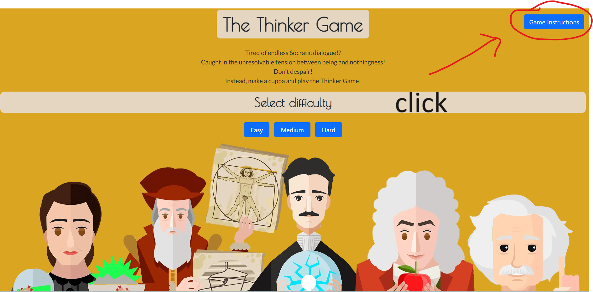
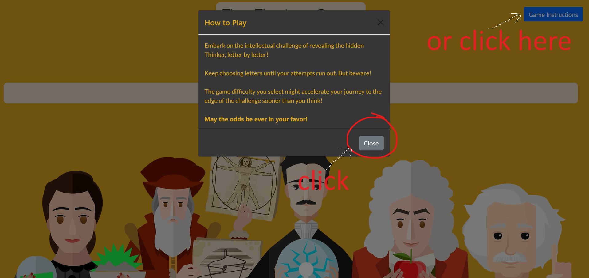

2. Adaptable Difficulty Levels: A feature allowing me to choose from various difficulty levels, tailoring the game's challenge to my preference.

| **Feature**    | **Action**                                                           | **Expected Result**                               | **Actual Result** |
| -------------- | -------------------------------------------------------------------- | ------------------------------------------------- | ----------------- |
| Difficulty select buttons  | Select preferred difficulty using the options of easy, medium and difficult buttons| Attempts left will adjust accordingly (easy=8, medium=6 hard=4) | Works as expected |

Screenshot

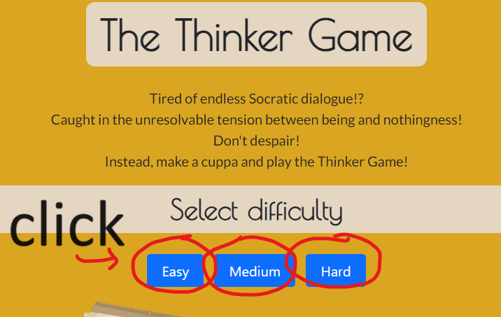
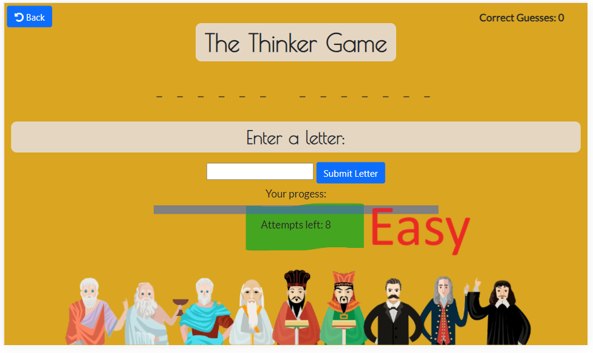
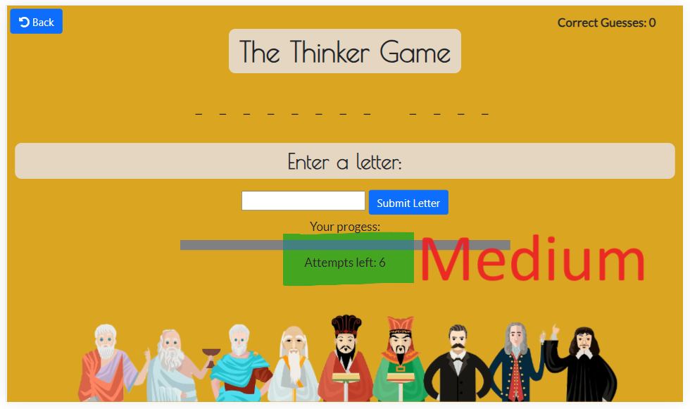
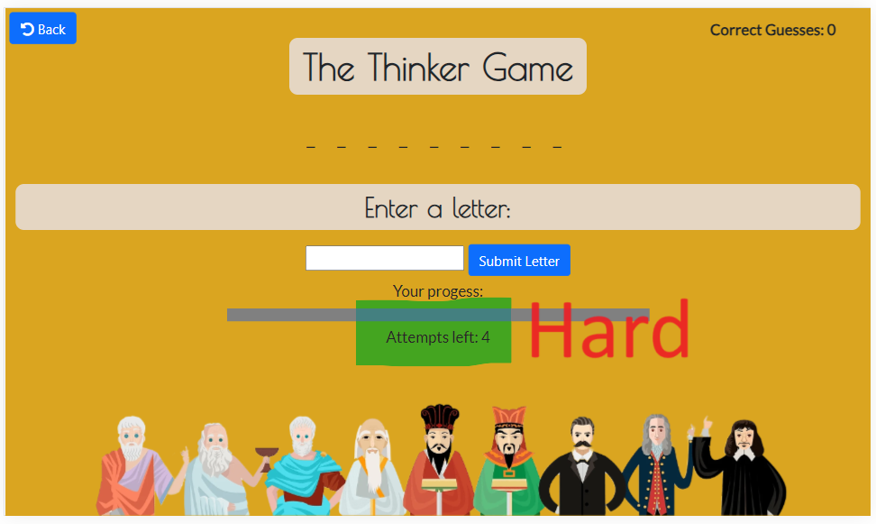

3. A hint function that displays on the final attempt at guessing the hidden thinker. 

| **Feature**             | **Action**                                                             | **Expected Result**                                                                                     | **Actual Result** |
| ----------------------- | ---------------------------------------------------------------------- | ------------------------------------------------------------------------------------------------------- | ----------------- |
| Provide hint function  | When attempts left equals one a hint is provided that gives a clue as to the hidden thinks identity | Hint is correctly displayed at last attempt | Works as expected |

Screenshot

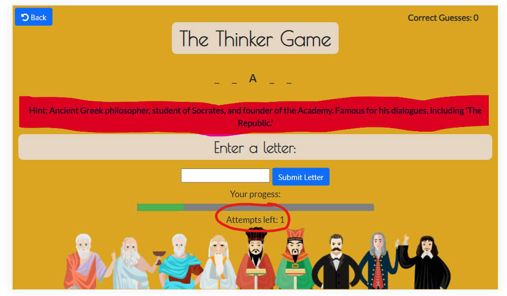

4. Progress Tracking: A visual representation of my progress alongside the remaining number of attempts in each round, ensuring a clear understanding of my progress.

| **Feature**                           | **Action**                               | **Expected Result**                                                       | **Actual Result** |
| ------------------------------------- | ---------------------------------------- | ------------------------------------------------------------------------- | ----------------- |
| Progress bar |The progress bar fills as the user inputs correct letters, visually illustrating their proximity to correctly guessing the philosopher| The progress bar is displayed below the letter submit button and fills according to how many letters are left to guess | Works as expected |

Screenshot

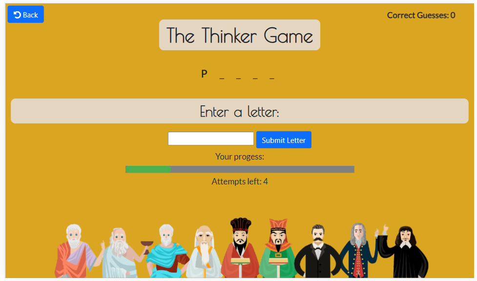
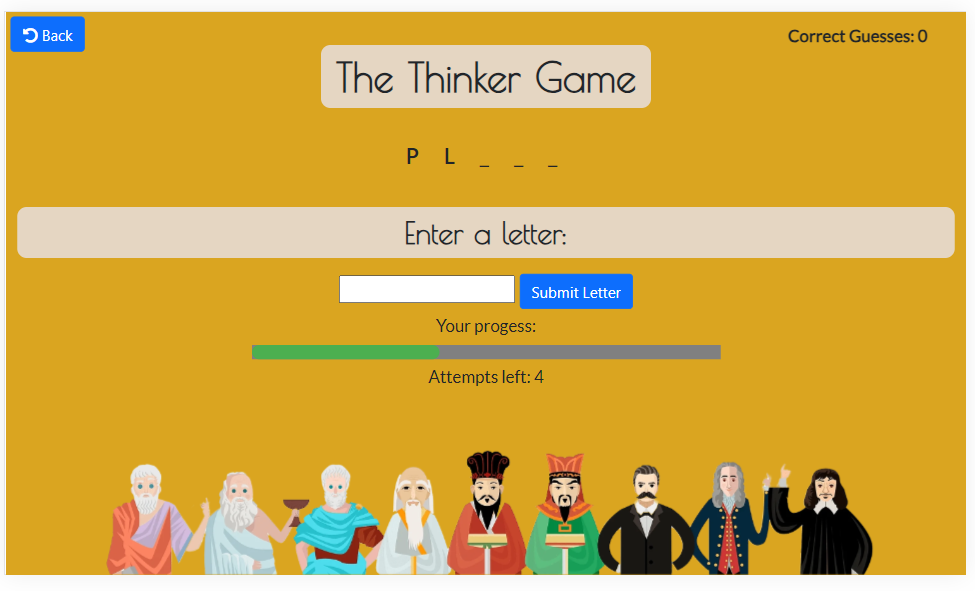
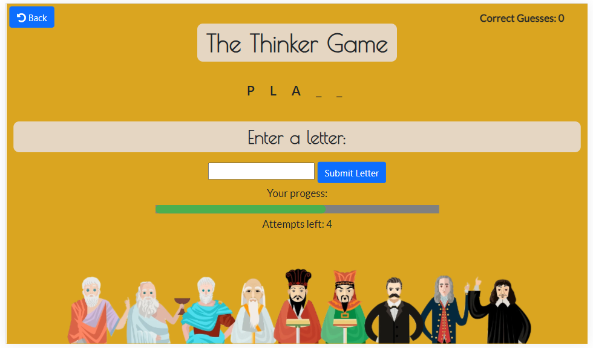
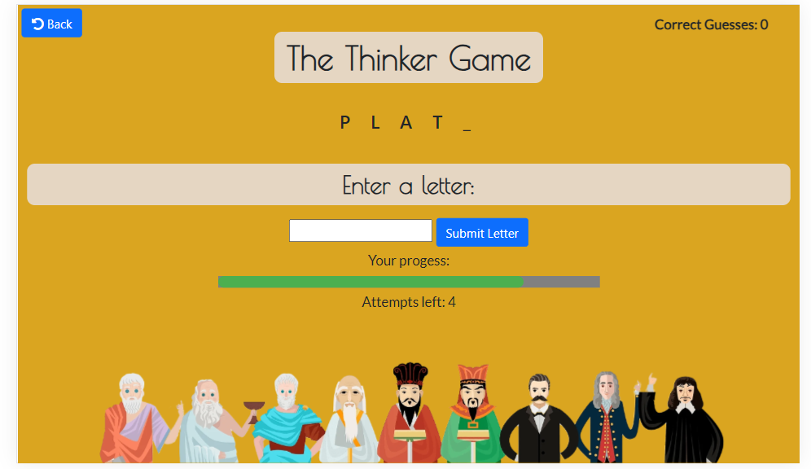

5. Result Display: After successfully guessing a word, I would like to see a message of congratulations alongside a philosophical quote, adding a sense of achievement to the gameplay.

| **Feature** | **Action**                                                               | **Expected Result**                                                                        | **Actual Result** |
| ----------- | ------------------------------------------------------------------------ | ------------------------------------------------------------------------------------------ | ----------------- |
| End Game screen | Guess the hidden thinker within the given number of attempts | Congratulations screen displays with a picture of Euripides and a philosophical quote | Works as expected |

Screenshot

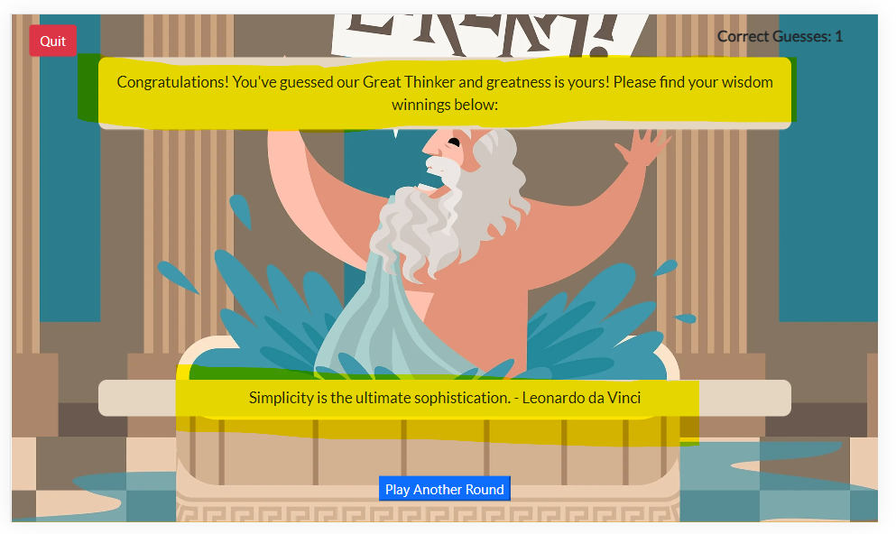

6.  After incorrectly guessing the word, I would like to immediately know what the correct answer was. 

| **Feature** | **Action**                                                               | **Expected Result**                                                                                              | **Actual Result** |
| ----------- | ------------------------------------------------------------------------ | ---------------------------------------------------------------------------------------------------------------- | ----------------- |
| End Game Screen | When all guess attempts have been used and the hidden thinker has not been identified | The correct answer is displayed | Works as expected |

Screenshot

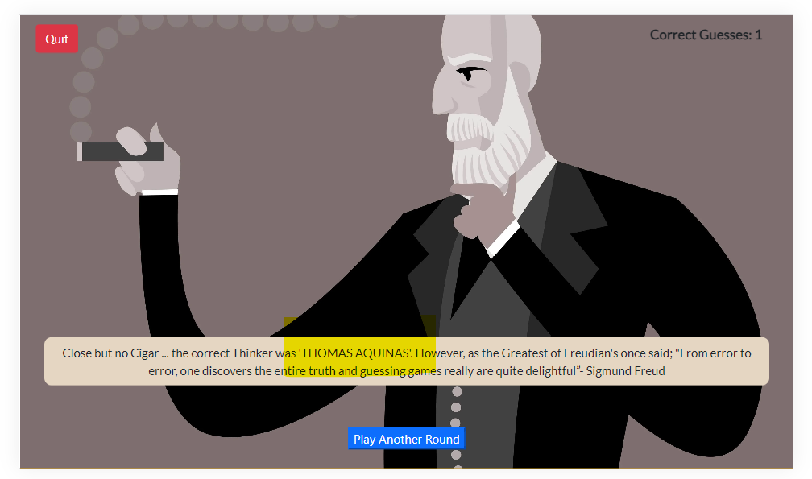

7.  A scoreboard to track the frequency of correct answers, providing a clear record of successful guesses. 

| **Feature**          | **Action**                                                                            | **Expected Result**                                             | **Actual Result** |
| -------------------- | ------------------------------------------------------------------------------------- | --------------------------------------------------------------- | ----------------- |
| Scoreboard | Correctly guess the hidden thinker | The amount of correct guesses is saved on the scoreboard displayed on both the main game and end game section | Works as expected |

Screenshot

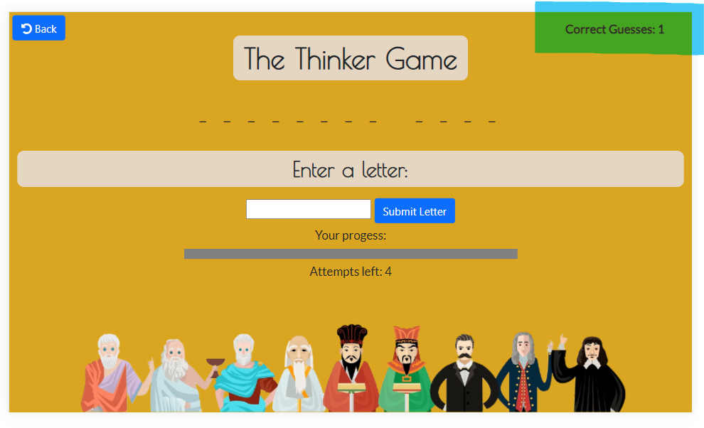
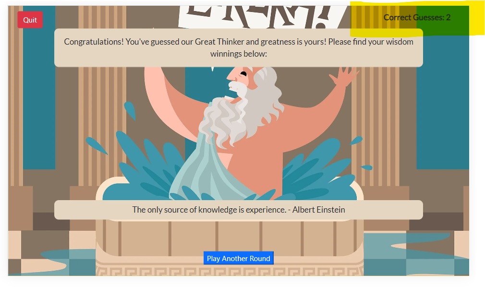

8. Clear Game Understanding and navigation: Ensuring users easily comprehend the game mechanics for a seamless and enjoyable experience.

| **Feature**        | **Action**                                                  | **Expected Result**             | **Actual Result** |
| ------------------ | ----------------------------------------------------------- | ------------------------------- | ----------------- |
| Simple navigation buttons | 1. User wants to return to the start screen during game play to change difficulty setting 2. Upon end of game user wants to quit/ or play again. | 1. "back" button returns user to start screen 2.  User can choose to either "play again" or "quit" by pressing the relevant button on the end game screen  | Works as expected |

Screenshot

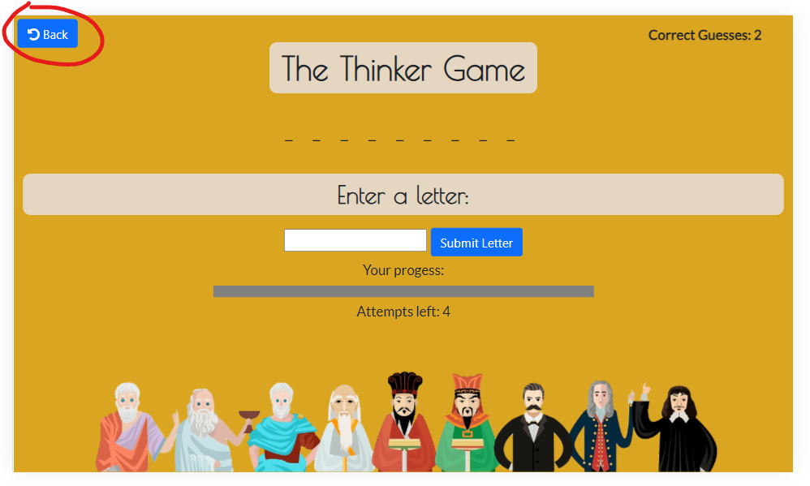
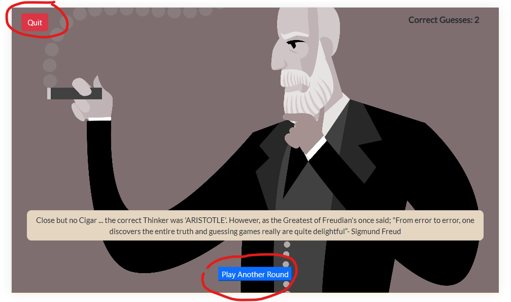

9. Self-Challenge Capability: Providing users with the opportunity to change the difficulty setting and enhance their skills while playing.

| **Feature**    | **Action**                                                           | **Expected Result**                               | **Actual Result** |
| -------------- | -------------------------------------------------------------------- | ------------------------------------------------- | ----------------- |
| Difficulty select buttons  | Select preferred difficulty using the options of easy, medium and difficult buttons| Attempts left will adjust accordingly (easy=8, medium=6 hard=4) | Works as expected |

Screenshot

10. Full Responsiveness: Designing the game to adapt effortlessly to various screen sizes and devices, ensuring accessibility for all users.

| **Feature**  | **Action**                               | **Expected Result**       | **Actual Result** |
| ------------ | ---------------------------------------- | ------------------------- | ----------------- |
| Responsive design used throughout project | Change device or screen size | Displays correctly without layout issues | Works as expected |

Screenshot

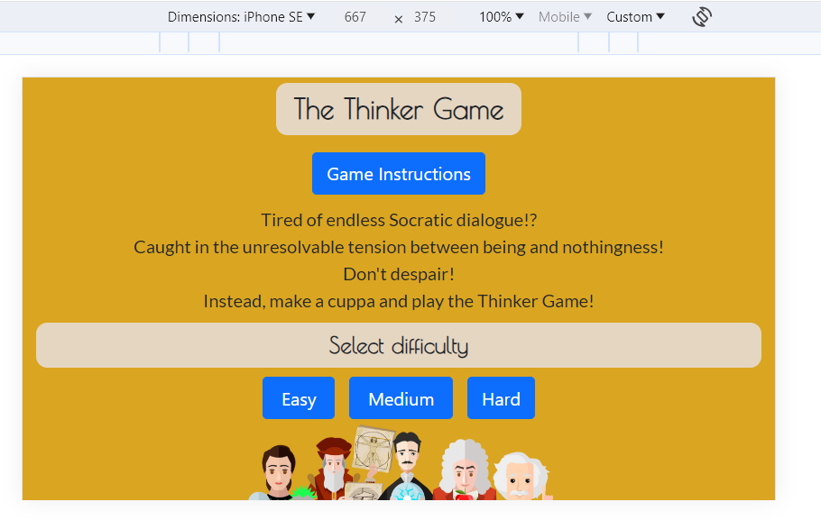
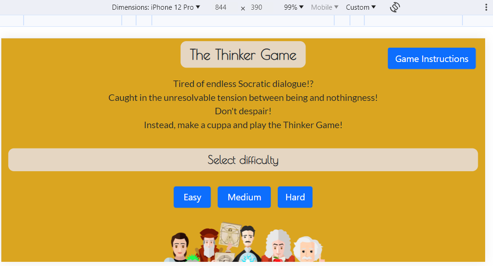
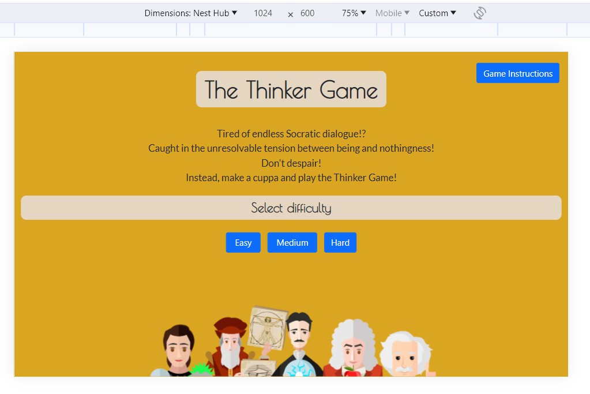
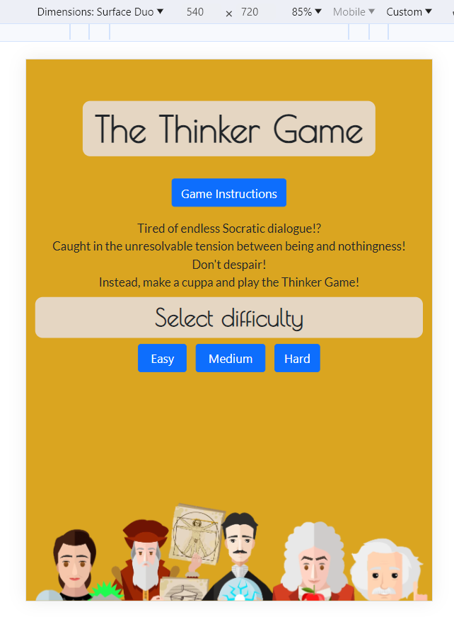
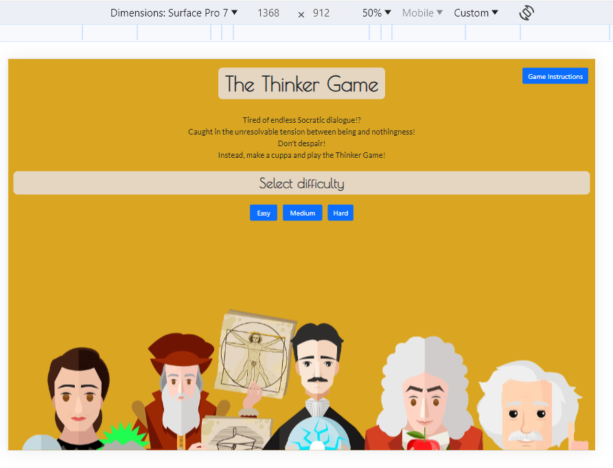

11. The user to be directed to a custom 404 error page upon entering a non-existent URL, eliminating the need to rely on the browser's back button.

| **Feature**                      | **Action**                                           | **Expected Result**                        | **Actual Result** |
| -------------------------------- | ---------------------------------------------------- | ------------------------------------------ | ----------------- |
| 404 error page | Page cannnot be found |  Directs user back to the game via 404 error page if they type a url that doesnt exist| Works as expected |

Screenshot

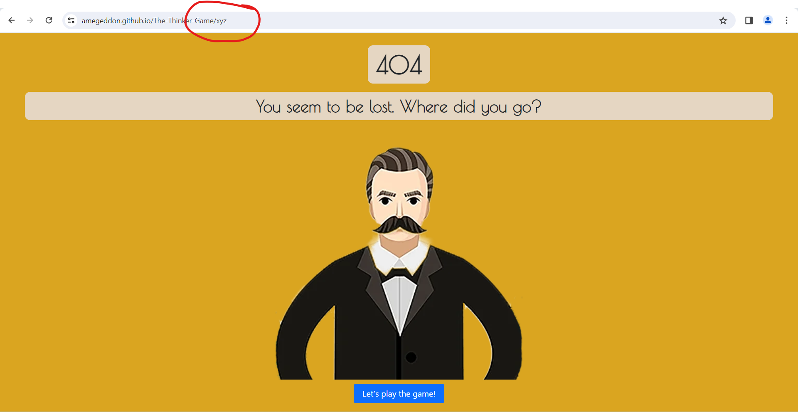

## Bugs

| Bug                                                                                                                                         | Fix                                                                                    |
| ------------------------------------------------------------------------------------------------------------------------------------------- | -------------------------------------------------------------------------------------- |
| Horizontal scroll on end game screen  | Misisng class "container fluid" from end game screen div   | 
ProvideHint function failing to display hint | Console log debugging revealed that hintIndex was not returning as true, reason being that the original names array was in lowercase and the hiddenName was being changed to uppercase. issue resolved by adding "to.lowercase" to hiddenName in hintIndex variable.        
| Message displayed when correct answer found was clashing with the quote message that is also displayed   |   Giving the quote message a unique id seperate from that of the message resolved this.                                                               |                             | Added a unique id to the quote. 
| On mobile devices in landscape orientation game is dominated by image and unplayable       |  Added media query targeting devices in landscape orientation.              |
|   After tidying code game stopped functioning as expected. Letters that were in the guessed name were not being displayed.                                               |  I had moved the const letters variable into the global list of variables. The letter was not being converted to uppercase and therefore was not validating as true. Placing the letters variable back into the handleGuess function corrected the bug.                       |
| Failing html validator as section tag used without heading  | Changed to div elements instead                                                    |
Mobile landscape media query clashing with tablet media query  |     Moving the media query from bottom of style sheet to below mobile queries helped. Targeting problematic elements with more specific css using classes such as .heading for the game title did solve some of the issues, but left some unsolvable ones.  Adding max height 500px to the mobile orientation landscape media query stopped the clash with the tablet media query and resolved the issue.                              | 404 page scoring 95 on best practice lighthouse testing | Console logging an error from js script, removed script tag from 404 html to resolve problem. 
| Parse error in css file   |  Css validator highlighted a parse error at line 597, unclosed media query on line 510 causing the problem. Closing it resolved the issue.                           
|             |                             |

## Deployment

### GitHub Pages

The website was deployed using GitHub Pages by following these steps:

1. In the GitHub repository navigate to the Settings tab
2. On the left hand menu select Pages
3. For the source select Branch: main
4. Once saved, GitHub will refresh and your website will be publishd from GitHub repository
5. The link to your published website will appear: "Your site is published at https://amegeddon.github.io/The-Thinker-Game/"

### Forking the GitHub Repository

1. Go to the GitHub repository
2. Click on Fork button in top right corner

### Making a Local Clone

1. Go to the GitHub repository
2. Locate the Code button above the list of files and click it
3. Highlight the "HTTPS" button to clone with HTTPS and copy the link
4. Open Git Bash
5. Change the current working directory to the one where you want the cloned directory
6. Type git clone and paste the URL from the clipboard ($ git clone https://github.com/YOUR-USERNAME/YOUR-REPOSITORY)
7. Press Enter to create your local clone

## Credits

### Images

- arrow used on back button was taken from [Fontawesome](https://fontawesome.com/)
- The four images used all come from Adobe Stock images and have been licensed for use [Adobe Stock Images](https://stock.adobe.com/uk)
- Images edited to remove background and resized using adobe Photoshop 

### Code

- [Instructions Modal](https://getbootstrap.com/docs/5.1/components/modal) was built using the Bootstrap v5.1.3 documentation
- https://codepen.io/cathydutton/pen/JjpxMm was used for guidance only in putting together the basic guessing game. 

## Acknowledgements

Thanks in plentiful supply for everyone who has put up with me cursing javascript. 

- to my mentor Richard for reminding me at every mentor meeting that Javascript is brilliant
- and to everyone else that I have hounded into playing the game and giving me feedback
- finally, thanks to the slack community for their encouragement and advice. 

